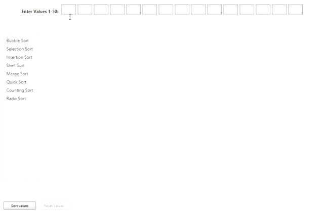

# JavaFX Visualization for Different Sorting Algorithms
This project utilizes JavaFX to visualize different types of sorting algorithms using a bar chart. User can enter up to 15 values between 1-50 and chose between different algorithms to see how they differ in sorting.

## Available Algorithms
* Bubble Sort
* Counting Sort
* Insertion Sort
* Merge Sort
* Quick Sort
* Radix Sort
* Selection Sort
* Shell Sort

## How to Use
* Enter values in the fields at the top of the window
  * Values must be between 1-50 (except for Radix Sort, which must be between 10-50)
  * Must enter at least one value, but can enter between 1-15 values
* Select an algorithm from the list on the left
* Select Sort button to see values sorted
* Once bars have completed sorting, select Reset to reset values to original order
* One bars are reset, you can:
  * Select another algorithm and re-sort
  * Add more values to sort (if there are less than 15 already)
  * Change any of the values being sorted
